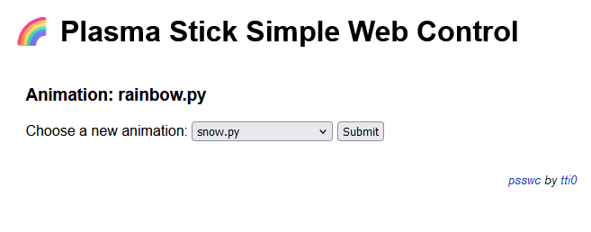

# psswc

🌈 Plasma Stick Simple Web Control

Control the animation running on your [Pimoroni Plasma Stick 2040W](https://shop.pimoroni.com/products/plasma-stick-2040-w) through a simple Pico-hosted web interface, written in MicroPython.

- Since the RP2040 is a dual-core MCU, one core can be dedicated to running the lightweight asynchronous web server, whilst the other plays user-defined animations (written in MicroPython and stored in the `userscripts` directory) on the attached Neopixel LEDs.
- The animation choices on the control web page are automatically populated from the contents of `userscripts`, so adding a new animation script is simple.
- Animation scripts can make use of all the Plasma Stick and Raspberry Pi Pico W's functionality, including making web requests of their own, or interacting with other hardware.
- The selected animation is stored on the Plasma Stick, and automatically played on device startup.

## Instructions

1. Download the latest Pimoroni MicroPython UF2 firmware from [here](https://github.com/pimoroni/pimoroni-pico/releases/). Choose the firmware with filename matching `pimoroni-picow-vx.y.z-micropython.uf2`, and flash to the Plasma Stick 2040W using the instructions [here](https://learn.pimoroni.com/article/getting-started-with-pico#installing-the-custom-firmware).
1. Clone this repository with Git or download it as a ZIP file from [this link](https://github.com/tti0/psswc/archive/refs/heads/main.zip).
1. Rename `micropython/WIFI_CONFIG_EXAMPLE.py` to `micropython/WIFI_CONFIG.py` and update its contents to provide:
    - `SSID` &ndash; the name of your WiFi network
        - e.g. `MyNetwork`
    - `PSK` &ndash; the password, if any, of your WiFi network
        - e.g. `MyPassword`
    - `COUNTRY` &ndash; the [two-letter country code](https://en.wikipedia.org/wiki/ISO_3166-1_alpha-2) for your location, for proper WiFi configuration
        - e.g. `GB`
    - `STATIC_IP` &ndash; the static IP address (IPv4) at which you would like to access the control web site
        - e.g. `192.168.1.50`
    - `STATIC_SUBNET_MASK`&ndash; the subnet mask for your network
        - e.g. `255.255.255.0`
    - `STATIC_GATEWAY` &ndash; the IP address (IPv4) of your router
        - e.g. `192.168.1.1`
    - `STATIC_DNS_SERVER` &ndash; the IP address (IPv4) of a DNS server
        - e.g. `8.8.8.8`
1. Using [Thonny](https://thonny.org/), copy the contents of the `micropython` directory to the root of the Pi Pico filesystem.
1. Reset the Plasma Stick using the provided button, and navigate to the IP address you specified earlier in a web browser.
1. Choose your first animation to play!

### Optional: adding your own animation scripts

- To add your own MicroPython animation script, place a single .py file for each in `micropython/userscripts`.
- This .py file **must** contain a `main` function, which should contain the main loop of your animation.
- The name of this .py file **must** comprise lower-case letters and underscores only.
- If your script makes HTTP requests of its own, there is no need to connect to WiFi again there, as the animation scripts inherit the WiFi connection of the main web server script.
- Running another web server in the animation script is untested, and is unlikely to work without major modification to the `main.py` program.

## Licensing

This project is Copyright (c) tti0 2024, and licenced under the _MIT Licence_. Please see `LICENSE` for full details.

The example animation scripts provided in `micropython/userscripts` are Copyright (c) Pimoroni Ltd 2021, and licensed under the _MIT Licence_, with original source code available [here](https://github.com/pimoroni/pimoroni-pico/blob/main/LICENSE).
